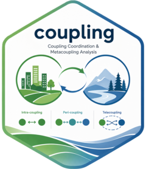

# coupling

<!-- badges: start -->

<!-- [](https://CRAN.R-project.org/package=coupling)
[](https://CRAN.R-project.org/package=coupling)
[](https://cran.r-project.org/web/checks/check_results_coupling.html)
[](https://CRAN.R-project.org/package=coupling)
[](https://CRAN.R-project.org/package=coupling)
[](http://www.gnu.org/licenses/gpl-3.0.html)
[](https://lifecycle.r-lib.org/articles/stages.html#experimental)
[](https://github.com/stscl/coupling/actions/workflows/R-CMD-check.yaml)
[](https://stscl.r-universe.dev/coupling) -->

<!-- badges: end -->

<a href="https://stscl.github.io/coupling/"></a>

***Coupling** Coordination Analysis*

*coupling* is an R package for coupling coordination analysis based on coupling coordination degree (CCD) models. It incorporates metacoupling frameworks to characterize cross-scale linkages, flows, and feedbacks within and among coupled systems.

> *Refer to the package documentation <https://stscl.github.io/coupling/> for more detailed information.*

## Installation

- Install from [CRAN](https://CRAN.R-project.org/package=coupling) with:

``` r
install.packages("coupling", dep = TRUE)
```

- Install binary version from [R-universe](https://stscl.r-universe.dev/coupling) with:

``` r
install.packages("coupling",
                 repos = c("https://stscl.r-universe.dev",
                           "https://cloud.r-project.org"),
                 dep = TRUE)
```

- Install from source code on [GitHub](https://github.com/stscl/coupling) with:

``` r
if (!requireNamespace("devtools")) {
    install.packages("devtools")
}
devtools::install_github("stscl/coupling",
                         build_vignettes = TRUE,
                         dep = TRUE)
```

## References

Schreiber, T., 2000. Measuring Information Transfer. Physical Review Letters 85, 461–464. https://doi.org/10.1103/physrevlett.85.461.

Kraskov, A., Stogbauer, H., Grassberger, P., 2004. Estimating mutual information. Physical Review E 69. https://doi.org/10.1103/physreve.69.066138.

Martinez-Sanchez, A., Arranz, G., Lozano-Duran, A., 2024. Decomposing causality into its synergistic, unique, and redundant components. Nature Communications 15. https://doi.org/10.1038/s41467-024-53373-4.

Zhang, X., Chen, L., 2025. Quantifying interventional causality by knockoff operation. Science Advances 11. https://doi.org/10.1126/sciadv.adu6464.

Varley, T.F., 2025. Information theory for complex systems scientists: What, why, and how. Physics Reports 1148, 1–55. https://doi.org/10.1016/j.physrep.2025.09.007.
