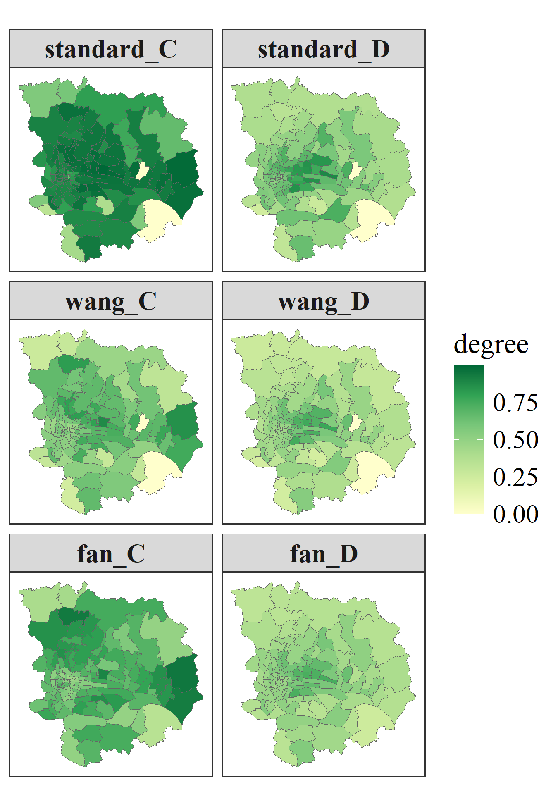
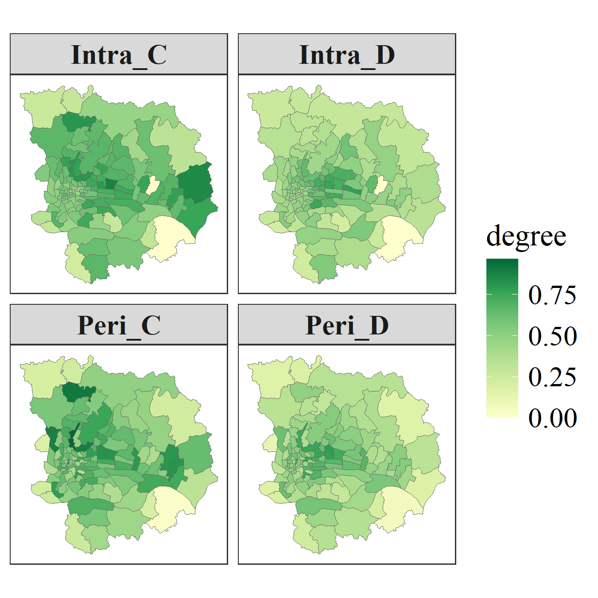

# Introduction

The **Coupling Coordination Degree (CCD) model** is widely used to quantify the degree of coupling and coordinated development among multiple subsystems. Originating from physics, it has been extensively applied in regional and human–environment systems.

## Coupling Degree

Given *n* normalized subsystem indicators $U_i$, the standard coupling degree $C$ is defined as:

$$
C = \left[ \frac{\prod_{i=1}^{n} U_i}{\left( \frac{1}{n} \sum_{i=1}^{n} U_i \right)^n} \right]^{\frac{1}{n}}
$$

Although widely used, this formulation may suffer from **scale sensitivity and over-amplification effects** due to the power structure. To address these issues, several formulations have been proposed by modifying the functional form of the coupling degree.

## Modified Coupling Degree

### Modification by $\text{wang}^{[1]}$.

**First**, Wang et al. introduce a formulation that incorporates pairwise differences among subsystems while normalizing their relative magnitudes:

$$
C = \sqrt{\left[1-\frac{\sum\limits_{i>j,j=1}^{n-1} \sqrt{\left(U_i-U_j\right)^2}}{\sum_{m=1}^{n-1}m}\right] \times \left(\prod_{i=1}^n \frac{U_i}{\text{max} U_i}\right)^{\frac{1}{n-1}}}
$$

### Modification by $\text{fan}^{[2]}$.

**Alternatively**, Fan et al. propose a simplified structure derived from variance-like dispersion, which directly captures the imbalance among subsystem indicators:

$$
C = 1-2\sqrt{\frac{n\sum_{i=1}^n U_i^2 - \left(\sum_{i=1}^n U_i\right)^2}{n^2}}
$$

## Comprehensive Development Index

The overall development level is defined as:

$$
T = \sum_{i=1}^{n} \alpha_i U_i
$$

where $\alpha_i$ are weights with $\sum \alpha_i = 1$.

## Coordination Degree

The coordination degree $D$ integrates interaction $C$ and development $T$:

$$
D = \sqrt{C \times T}
$$

where  
- $C$ measures coupling degree  
- $T$ measures development level  
- $D$ reflects coordinated development  

## Metacoupling Perspective

The CCD framework can be extended under the $\text{metacoupling framework}^{[3,4]}$, distinguishing:

- **Intracoupling**  
- **Pericoupling**  
- **Telecoupling**  

This enables cross-scale analysis of coupling.

# Example Cases

## Install necessary packages and load data


``` r
install.packages(c("sdsfun", "coupling", "tidyr", "dplyr", "ggplot2"), dep = TRUE)
```

The `gzma` dataset represents the *Data of Social Space Quality in Guangzhou Metropolitan Areas of China (2010)*. It contains multiple indicators describing urban social space conditions. In particular, four key variables correspond to subsystem scores, including population stability (`PS_Score`), educational level (`EL_Score`), occupational hierarchy (`OH_Score`), and income level (`IL_Score `).

Load the `gzma` dataset from the `sdsfun` package:


``` r
gzma = sf::read_sf(system.file('extdata/gzma.gpkg',package = 'sdsfun'))
gzma
## Simple feature collection with 118 features and 4 fields
## Geometry type: POLYGON
## Dimension:     XY
## Bounding box:  xmin: 113.1485 ymin: 22.94659 xmax: 113.5628 ymax: 23.33026
## Geodetic CRS:  WGS 84
## # A tibble: 118 × 5
##    PS_Score EL_Score OH_Score IL_Score                                                         geom
##       <dbl>    <dbl>    <dbl>    <dbl>                                                <POLYGON [°]>
##  1     7.21     4.64     4.75     2.64 ((113.2797 23.13359, 113.2715 23.13413, 113.2682 23.13371, …
##  2     3.55     3.81     3.91     4.06 ((113.2519 23.15353, 113.2497 23.15545, 113.254 23.15774, 1…
##  3     7.94     4.69     4.86     3.31 ((113.2815 23.12902, 113.2749 23.12969, 113.2732 23.12523, …
##  4     8.22     4.93     4.92     3.74 ((113.3098 23.12458, 113.3046 23.12448, 113.3026 23.12642, …
##  5     7.84     4.74     4.98     4.69 ((113.3099 23.11566, 113.3087 23.11542, 113.2957 23.11531, …
##  6     8.12     5.13     4.98     3.92 ((113.2864 23.13354, 113.2863 23.135, 113.2884 23.1375, 113…
##  7     8.30     5.18     4.87     3.77 ((113.2797 23.13359, 113.2799 23.13956, 113.274 23.14182, 1…
##  8     5.14     4.43     4.41     4.13 ((113.3013 23.16168, 113.2985 23.16208, 113.296 23.16051, 1…
##  9     5.92     4.18     4.37     2.29 ((113.2631 23.12832, 113.2586 23.12813, 113.2592 23.12228, …
## 10     6.99     4.32     4.24     2.72 ((113.2747 23.12164, 113.2727 23.12362, 113.2732 23.12523, …
## # ℹ 108 more rows
```

Normalize the `*_Score` columns:


``` r
dt = apply(sf::st_drop_geometry(gzma), 2,
           \(.x) (.x - min(.x)) / (max(.x) - min(.x)))
head(dt)
##    PS_Score  EL_Score  OH_Score  IL_Score
## 1 0.8179733 0.3246648 0.6590316 0.1308531
## 2 0.3020233 0.1318888 0.4046987 0.5173794
## 3 0.9209903 0.3353516 0.6921477 0.3141320
## 4 0.9604095 0.3914758 0.7099999 0.4316421
## 5 0.9061589 0.3473603 0.7297774 0.6909494
## 6 0.9456379 0.4391423 0.7304117 0.4792905
```

## Analysis of coupling coordination degree


``` r
ccd_standard = coupling::ccd(dt)
head(ccd_standard)
##           C         D
## 1 0.8051958 0.6237105
## 2 0.8914577 0.5497290
## 3 0.8999423 0.7134825
## 4 0.9346128 0.7632959
## 5 0.9440912 0.7944703
## 6 0.9519923 0.7858001
```


``` r
ccd_wang = coupling::ccd(dt, method = "wang")
head(ccd_wang)
##           C         D
## 1 0.4722274 0.4776480
## 2 0.6211236 0.4588675
## 3 0.5375842 0.5514412
## 4 0.5861986 0.6045044
## 5 0.6640321 0.6662930
## 6 0.6319211 0.6402164
```


``` r
ccd_fan = coupling::ccd(dt, method = "fan")
head(ccd_fan)
##           C         D
## 1 0.4593785 0.4711049
## 2 0.7164548 0.4928249
## 3 0.4915051 0.5272784
## 4 0.5399620 0.5801746
## 5 0.5951898 0.6308098
## 6 0.5907777 0.6190239
```


``` r
ccd_df = do.call(cbind, list(ccd_standard, ccd_wang, ccd_fan))
names(ccd_df) = paste0(rep(c("standard", "wang", "fan"), each = 2),
                       "_", rep(c("C", "D"), times = 3))
fig1 = ccd_df |> 
  sf::st_set_geometry(sf::st_geometry(gzma)) |> 
  tidyr::pivot_longer(-geometry, names_to = "var", values_to = "val") |> 
  dplyr::mutate(var = factor(var, levels = names(ccd_df))) |> 
  ggplot2::ggplot() +
  ggplot2::geom_sf(ggplot2::aes(fill = val), color = "grey40", lwd = 0.15) +
  ggplot2::scale_fill_gradientn(
    name = "degree",
    colors = c("#ffffcc", "#d9f0a3", "#addd8e",
               "#78c679", "#31a354", "#006837")
  ) +
  ggplot2::facet_wrap(~var, ncol = 2) +
  ggplot2::theme_bw(base_family = "serif") +
  ggplot2::theme(
    panel.grid = ggplot2::element_blank(),
    axis.text = ggplot2::element_blank(),
    axis.ticks = ggplot2::element_blank(),
    strip.text = ggplot2::element_text(face = "bold", size = 15),
    legend.title = ggplot2::element_text(size = 16.5),
    legend.text = ggplot2::element_text(size = 15)
  )
fig1
```



## A Meta-Coupling Analysis

Due to data limitations, here we focus on **peri-coupling** based on a Queen contiguity structure. Pericoupling among neighboring units are further weighted using an inverse distance scheme. The calculation of the coupling coordination degree adopts the formulation proposed by $\text{wang}^{[1]}$.


``` r
nb = sdsfun::spdep_nb(gzma)
swm_peri = sdsfun::inverse_distance_swm(gzma)
for (i in seq_len(nrow(gzma))) {
  swm_peri[i, seq_len(nrow(gzma))[-nb[[i]]]] = 0
}
swm_peri = apply(swm_peri, 1, \(.x) .x / sum(.x))

mc_wang = coupling::metacoupling(dt, swm_peri = swm_peri, method = "wang")
head(mc_wang)
##     Intra_C   Intra_D    Peri_C    Peri_D Tele_C Tele_D
## 1 0.4722274 0.4776480 0.7414392 0.7507625      0      0
## 2 0.6211236 0.4588675 0.6712215 0.5061883      0      0
## 3 0.5375842 0.5514412 0.4539894 0.4644758      0      0
## 4 0.5861986 0.6045044 0.6692548 0.6808108      0      0
## 5 0.6640321 0.6662930 0.6880871 0.6870927      0      0
## 6 0.6319211 0.6402164 0.6064480 0.6032699      0      0
```


``` r
fig2 = mc_wang |> 
  dplyr::select(dplyr::all_of(c("Intra_C", "Intra_D", "Peri_C", "Peri_D"))) |> 
  sf::st_set_geometry(sf::st_geometry(gzma)) |> 
  tidyr::pivot_longer(-geometry, names_to = "var", values_to = "val") |> 
  dplyr::mutate(var = factor(var, 
                             levels = c("Intra_C", "Intra_D", "Peri_C", "Peri_D"))) |> 
  ggplot2::ggplot() +
  ggplot2::geom_sf(ggplot2::aes(fill = val), color = "grey40", lwd = 0.15) +
  ggplot2::scale_fill_gradientn(
    name = "degree",
    colors = c("#ffffcc", "#d9f0a3", "#addd8e",
               "#78c679", "#31a354", "#006837")
  ) +
  ggplot2::facet_wrap(~var, ncol = 2) +
  ggplot2::theme_bw(base_family = "serif") +
  ggplot2::theme(
    panel.grid = ggplot2::element_blank(),
    axis.text = ggplot2::element_blank(),
    axis.ticks = ggplot2::element_blank(),
    strip.text = ggplot2::element_text(face = "bold", size = 15),
    legend.title = ggplot2::element_text(size = 16.5),
    legend.text = ggplot2::element_text(size = 15)
  )
fig2
```



## References

1. Wang, S., Kong, W., Ren, L. and ZHI, D., 2021. Research on misuses and modification of coupling coordination degree model in China. Journal of Natural Resources, 36, 793-810. [https://doi.org/10.31497/zrzyxb.20210319][1]

2. Fan, D., Ke, H. and Cao, R., 2024. Modification and improvement of coupling coordination degree model. Stat. Decis, 40, 41-46. [https://doi.org/10.13546/j.cnki.tjyjc.2024.22.007][2]

3. Tang, P., Huang, J., Zhou, H., Fang, C., Zhan, Y., Huang, W., 2021. Local and telecoupling coordination degree model of urbanization and the eco-environment based on RS and GIS: A case study in the Wuhan urban agglomeration. Sustainable Cities and Society 75, 103405. [https://doi.org/10.1016/j.scs.2021.103405][3]

4. Li, Y., Jia, N., Zheng, L., Yin, C., Chen, K., Sun, N., Jiang, A., Wang, M., Chen, R., Zhou, Z., 2026. A meta-coupling analysis between three-dimensional urbanization and ecosystem services in China’s urban agglomerations. Communications Earth & Environment 7. [https://doi.org/10.1038/s43247-025-03047-w][4]

&nbsp;

[1]: https://doi.org/10.31497/zrzyxb.20210319
[2]: https://doi.org/10.13546/j.cnki.tjyjc.2024.22.007
[3]: https://doi.org/10.1016/j.scs.2021.103405
[4]: https://doi.org/10.1038/s43247-025-03047-w
